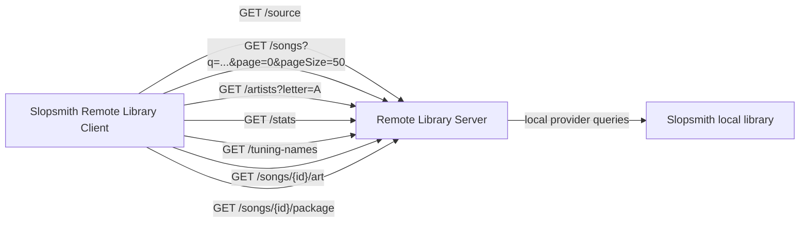

# Slopsmith Remote Library Server

Remote Library Server is a source-side Slopsmith plugin for sharing the current Slopsmith local library over a small direct HTTP API. It runs on its own port, separate from Slopsmith's main backend, and is designed to be consumed by the Remote Library Client plugin.

The direct server is a thin wrapper around Slopsmith's `local` library provider. It does not build or publish a second catalog of its own; the songs, filters, sort order, artwork, and package downloads reflect what the local Slopsmith library provider exposes.

## What It Does

- Starts a direct library server on a configurable host and port.
- Waits for Slopsmith's startup library scan to finish before autostarting, so it does not race the local index.
- Lists local PSARC and Sloppak packages as remote song summaries using paged provider queries.
- Supports the same core library search/filter/sort parameters used by the client library UI.
- Serves artwork through Slopsmith's local provider.
- Serves original package files for remote load/play.
- Exposes artist tree, stats, and tuning-name helper endpoints for the remote Library UI.
- Allows a client plugin to connect by base URL.

## Direct Flow



## API

When the server is running, the client only needs the server base URL, for example `http://127.0.0.1:8765`, or `http://192.168.1.X:8765`.

- `GET /health`
- `GET /source`
- `GET /songs?q=&page=0&pageSize=50&sort=artist&direction=asc`
- `GET /artists?letter=&q=&page=0&pageSize=50`
- `GET /stats?q=&format=&arrangements_has=&stems_has=&has_lyrics=&tunings=`
- `GET /tuning-names`
- `GET /songs/{remoteSongId}/art`
- `GET /songs/{remoteSongId}/package`

`/songs` also accepts the legacy cursor form (`cursor=0`) for clients that page by offset. Search/filter parameters include `format`, `arrangements_has`, `arrangements_lacks`, `stems_has`, `stems_lacks`, `has_lyrics`, and `tunings`.

The plugin also exposes management endpoints on Slopsmith's main backend:

- `GET /api/plugins/remote_library_server/settings`
- `POST /api/plugins/remote_library_server/settings`
- `GET /api/plugins/remote_library_server/status`
- `POST /api/plugins/remote_library_server/start`
- `POST /api/plugins/remote_library_server/stop`
- `GET /api/plugins/remote_library_server/activity`
- `GET /api/plugins/remote_library_server/local-songs`

## Settings

- `enabled`: starts the direct server when the plugin loads.
- `host`: bind host. Use `127.0.0.1` for same-machine access or `0.0.0.0` for LAN access.
- `port`: bind port. Default: `8765`.
- `sourceName`: display name returned by `/source`.

If `enabled` is true during Slopsmith startup, the plugin reports `waitingForScan` and starts the direct server after the local library scan reaches `complete`.

## Notes

- Remote song IDs are URL-safe encoded references to local library-relative filenames.
- Package downloads are resolved back under the configured Slopsmith DLC/library root and path-checked before serving.
- The direct server intentionally relies on Slopsmith's local provider instead of rescanning or hashing the library itself.
- Artwork responses are cached by clients and served with a short public cache header.

## Development

Run the focused tests from this plugin directory:

```bash
pytest
```